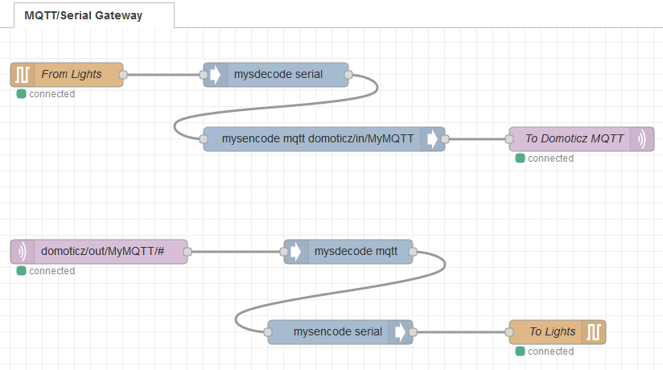

# Introduction
Connecting Arduino directly to HomeSystem application in some cases isn't enough.
One of the drawback is that only one application can be connected over serial interface.
There are some hacks, like `socat`, but why don't use MQTT gateway?
For me it is excelent choice, and also gives me opportunity to test another home application
at the same time when Domoticz.


# Requirements / assumptions
* Arduino board connected through UART (Serial/USB) - "/dev/ttyACM0"
* Docker
* Mosquitto
* Domoticz (optional)
I've test all commands as root using `sudo bash` after login - sorry for a bad practise :)


# Installation
## Node-Red on Docker
If you already have Node-Red, just skip to next step

Create directory as user with uid 1000 (usually "pi"):
```
sudo mkdir /docker/nodered
sudo chown 1000:1000 /docker/nodered
```
Now run the container (can take some time):
```
docker run -dit -p 1880:1880 -v /docker/nodered:/data --group-add dialout --device=/dev/ttyACM0 --name nodered nodered/node-red
#CTRL+C to leave docker - Node-Red will keep running in background
```
More about Node-Red in Docker - https://nodered.org/docs/getting-started/docker


## Node-Red modules
Enter into docker container:
```
docker exec -it nodered /bin/bash
```
and install required Node-Red modules:
```
  npm install --no-optional node-red-contrib-mysensors
  npm install --no-optional node-red-node-serialport
  exit
```
When installing outside docker, options "-g" and "--unsafe-perm" can be helpfull.

Optionaly you can create image, so you can faster recreate container:
```
docker commit nodered my-node-red
```
And from now you can re-create container using:
```
docker stop nodered
docker rm nodered
docker run -dit -p 1880:1880 -v /docker/nodered:/data --group-add dialout --device=/dev/ttyACM0 --restart always --name nodered my-node-red
#CTRL+C to leave docker - Node-Red will keep running in background
```


## MQTT Gateway on Node-Red
Create flow like this:


or import flow like this:
```
[{"id":"72d44000.f28408","type":"tab","label":"MQTT/Serial Gateway","disabled":false,"info":""},{"id":"95ef7ed6.7fb9e","type":"serial in","z":"72d44000.f28408","name":"From Lights","serial":"b5ac5c96.bd3248","x":90,"y":140,"wires":[["fecbb4a9.a5ea68"]]},{"id":"2fa5780d.136bf8","type":"serial out","z":"72d44000.f28408","name":"To Lights","serial":"b5ac5c96.bd3248","x":700,"y":460,"wires":[]},{"id":"5c13e55a.e2cfec","type":"mqtt out","z":"72d44000.f28408","name":"To Domoticz MQTT","topic":"","qos":"","retain":"","broker":"bbe453f9.77c5f","x":730,"y":220,"wires":[]},{"id":"d22c4b6.f01e938","type":"mqtt in","z":"72d44000.f28408","name":"","topic":"domoticz/out/MyMQTT/#","qos":"2","datatype":"auto","broker":"bbe453f9.77c5f","x":130,"y":360,"wires":[["f8a3c82a.95084"]]},{"id":"f8a3c82a.95084","type":"mysdecode","z":"72d44000.f28408","database":"","name":"","mqtt":true,"enrich":false,"x":440,"y":360,"wires":[["66725363.829d5c"]]},{"id":"fecbb4a9.a5ea68","type":"mysdecode","z":"72d44000.f28408","database":"","name":"","mqtt":false,"enrich":false,"x":350,"y":140,"wires":[["322780f7.dea218"]]},{"id":"322780f7.dea218","type":"mysencode","z":"72d44000.f28408","name":"","mqtt":true,"mqtttopic":"domoticz/in/MyMQTT","x":410,"y":220,"wires":[["5c13e55a.e2cfec"]]},{"id":"66725363.829d5c","type":"mysencode","z":"72d44000.f28408","name":"","mqtt":false,"mqtttopic":"","x":430,"y":460,"wires":[["2fa5780d.136bf8"]]},{"id":"b5ac5c96.bd3248","type":"serial-port","z":"","serialport":"/dev/ttyACM0","serialbaud":"115200","databits":"8","parity":"none","stopbits":"1","waitfor":"","dtr":"none","rts":"none","cts":"none","dsr":"none","newline":"\\n","bin":"false","out":"char","addchar":"\\n","responsetimeout":"10000"},{"id":"bbe453f9.77c5f","type":"mqtt-broker","z":"","name":"Mosquitto","broker":"192.168.1.111","port":"1883","clientid":"","usetls":false,"compatmode":false,"keepalive":"60","cleansession":true,"birthTopic":"","birthQos":"0","birthPayload":"","closeTopic":"","closeQos":"0","closePayload":"","willTopic":"","willQos":"0","willPayload":""}]
```
Configurations:
* Serial port parameters: 115200-8N1, add character to output messages "\n"
* MQTT broker: just put IP and credentials


## Domoticz
Make database backup first!

Go to Configuration >> Hardware and select "MySensors Gateway USB".
Change it to "MySensors Gateway with MQTT interface", provide Mosquitto broker parameters (IP, portand credentials) and click update button.

